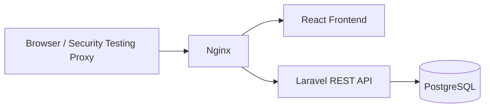
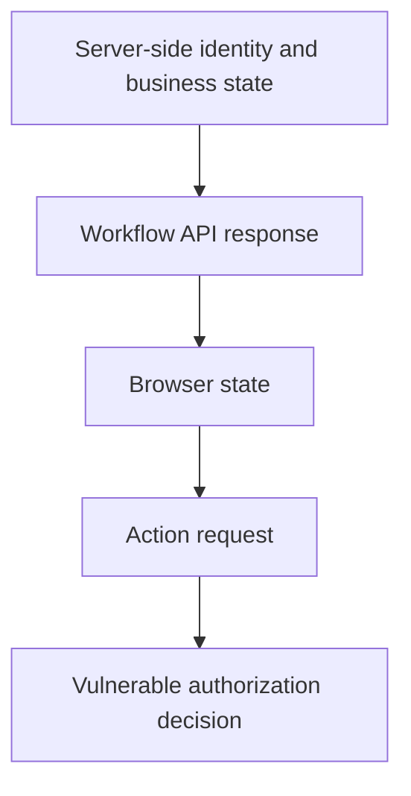
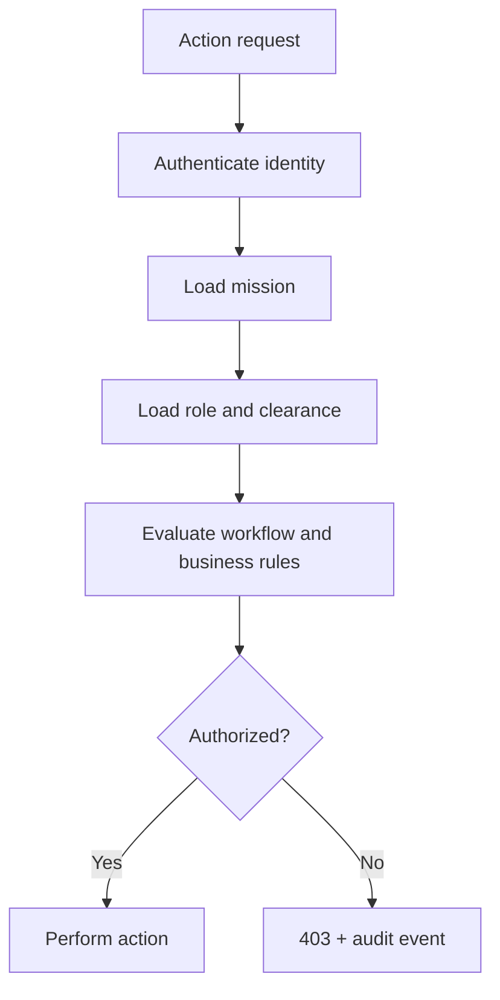

# AeroMed Mission Control — Architecture

## Logical architecture

## Security boundary

In vulnerable mode, the server incorrectly lets browser-controlled workflow state influence authorization.

## Secure authorization path

## Components

### Frontend

React + TypeScript + Vite. Responsible for presentation, workflow interaction, and user experience. It is untrusted from an authorization perspective.

### API

Laravel/PHP REST API. Owns authentication, business state, authorization, workflow transitions, and audit events.

### Database

PostgreSQL stores users, missions, routes, workflow sessions, actions, and audit logs.

### Reverse proxy

Nginx provides a simple local entry point and routes browser traffic to the frontend/API services.

## Trust model

Trusted:

- authenticated identity established by the server;
- server-side database state;
- server-side authorization policy.

Untrusted:

- browser memory;
- local storage;
- hidden UI controls;
- JSON fields supplied by the browser;
- capability values copied from an earlier response.
